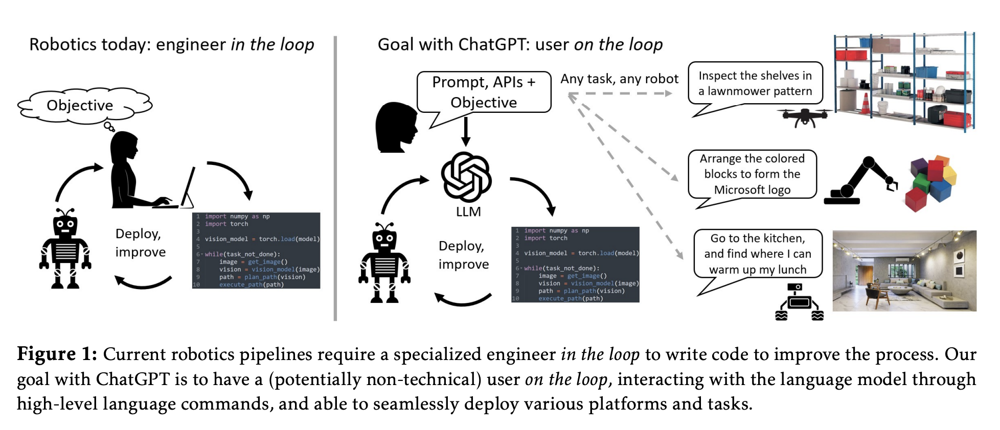

# Integrasi Robot dengan Large Languange Model (LLM)

Tujuan dari proyek ini adalah untuk mengimplementasikan LLM sebagai kontrol untuk robot arm (dobot magician).



## Context Prompt

Context prompt adalah prompt yang diberikan untuk memberikan informasi mengenai keadaan nyata robot (grounding reality). Hal ini diperlukan karena untuk mengontrol robot. LLM harus mengetahui kondisi nyata robot saat itu meliputi lingkungan sekita dan hal apa saja yang dapat dilakukan robot. Dalam konteks ini, informasi yang akan diberikan meliputi koordinat objek yang akan dimanipulasi serta fungsi high level yang digunakan untuk mengontrol robot (seperti gerakMaju()).

Berikut ini context prompt untuk robot

```
"Objective: Generate a sequence of JSON responses to plan the robot's actions based on user goals. If the goal is unattainable using the provided instructions and available object, return error message.

Provide a JSON object containing an array of actions, identified by the key "actions".

Each action should be represented as an object with the appropriate command and parameters.

Available Objects and Coordinates:

a. yellow_block: (249.62, 137.63, -55)
b. white_block: (266.05, 8.32, -53.46)

Available Commands:

a. "move": Move the robotic arm in a specific direction.
Include the "direction" within "parameters" with values "up", "down", "forward", "backward" "left", or "right".

b. "move_to": Move the robotic arm to specific coordinates.
Include the parameters "x", "y", and "z" within "parameters" to define the destination coordinates.

c. "suction_cup": Activate or deactivate the suction cup.
Include the "action" within "parameters" with values "on" or "off".

d. "err_msg": To return error if the user goal cannot be fullfilled using current object and command.
Include the "msg" within "parameters" with values "cannot generated plan using current condition" and nothing else.

Usage Instructions:

Choose appropriate commands based on the task requirements.
1. To move an available object, the robot must first activate the suction cup using the "suction_cup" command with the "action" parameter set to "on".
2. If you cannot fulfil user goal using current command and object, use err_msg command.
3. Provide the placement coordinates for the user's goal using the "move_to" command.
4. If you want the robot to move to the left or right of an object, first move the robot to the coordinates of that object using "move_to", then use the "move" command with the appropriate direction.

```

## Dataset

Untuk dataset akan dibagi mejadi 4 kategori

* Direct Command Calling: In this scenario, the user directly calls commands without any intermediate reasoning. Each action is performed based solely on the user's explicit instructions.
* Chain of Command: Here, the user provides a sequence of commands, and each subsequent command is based on the outcome of the previous one. This involves chaining actions together based on the robot's state and the user's goals.
* Reasoning: The robot uses reasoning to determine the best sequence of actions to achieve the user's goal. This involves analyzing the current state, understanding the task constraints, and planning a series of actions accordingly.
* Impossible Task Handling: If the user's goal is unattainable or conflicts with the task constraints, the system should recognize this and return error response.

## Format Training Dataset
Untuk format dataset untuk training rencana akan seperti berikut

```
template = "Instruction:\n{context}\n{user_goal}\n\nResponse:\n{response}"

```


